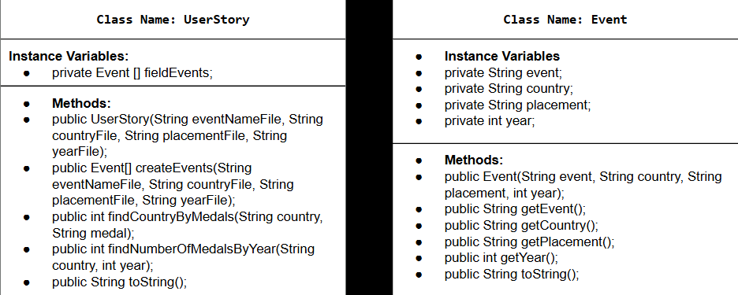

# Data-for-Social-Good-Project
This is my project about using a custom dataset and using it to answer questions!
# Unit 2 - Data for Social Good Project

## Introduction

Software engineers develop programs to work with data and provide information to a user. Each user has different needs based on the information they are looking for from data. Your goal is to create a data analysis program for your user that stores and analyzes data to provide the information they need.

## Requirements

Use your knowledge of object-oriented programming, one-dimensional (1D) arrays, and algorithms to create your data analysis program:
- **Write a class** – Write a class to represent your user or business and store and analyze their data with no-argument and parameterized constructors.
- **Create at least two 1D arrays** – Create at least two 1D arrays to store the data that your user needs information about.
- **Write a method** – Write a method that finds or manipulates the elements in a 1D array to provide the information your user needs.
- **Implement a toString() method** – Write a toString() method that returns general information about the data (for example, number of values in the dataset).
- **Document your code** – Use comments to explain the purpose of the methods and code segments and note any preconditions and postconditions.

## User Story 

> As track and field enthusiast,  
>we wanted to analyze the Olympic  
>Games and see how many metals a  
>country got between the track and  
>field events  the years 1976 - 2008.

## Dataset 

The hyperline to the dataset on Kaggle: https://www.kaggle.com/datasets/divyansh22/summer-olympics-medals
- **country** (String) - name of the country 
- **year** (int) - the year of the Olympic games 
- **placements** (String) - if the medal the country won was gold, silver, or bronze
- **eventName** (String) - the name of the event the country won the medal in

## UML Diagram 

Put an image of your UML Diagram here. Upload the image of your UML Diagram to your repository, then use the Markdown syntax to insert your image here. Make sure your image file name is one work, otherwise it might not properly get displayed on this README. 

 

## Description 

Write a description of your project here. In your description, include as many vocab words from our class to explain your User Story, the chosen dataset and how your project addressed that users goals. If your project used the Scanner class for user input, explain how the user will interact with your project.
My three questions:

1. How many gold medals did the USA get in total?
2. How many silver medals did the USA get in total?
3. How many medals did the USA get in total during the 2000 Olympic games?

For my project, the two method that I created was to find medals for the track and field events. The first method was to answere 